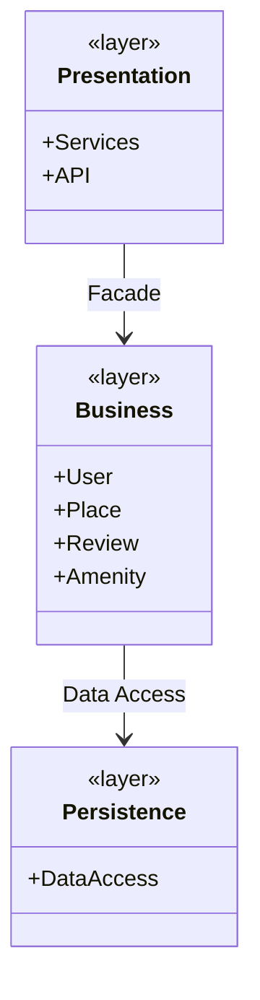
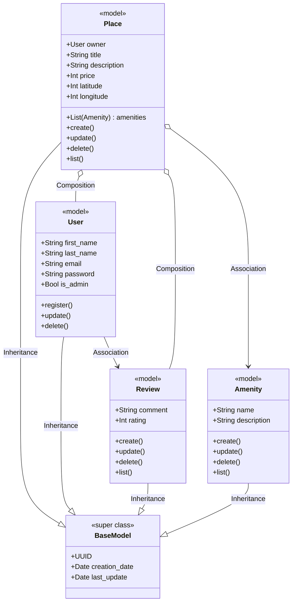

```mermaid
classDiagram
class Presentation {
    <<layer>>
    +Services
    +API
}
class Business {
    <<layer>>
    +User
    +Place
    +Review
    +Amenity
}
class Persistence {
    <<layer>>
    +DataAccess
}
Presentation --> Business : Facade
Business --> Persistence : Data Access
```

```mermaid
classDiagram

    class BaseModel {
    <<super class>>
    +UUID
    +Date creation_date
    +Date last_update
    }

    class User {
    <<model>>
    +String first_name
    +String last_name
    +String email
    +String password
    +Bool is_admin
    +register()
    +update()
    +delete()
    }

    class Place {
    <<model>>
    +User owner
    +String title
    +String description
    +Int price
    +Int latitude
    +Int longitude
    +List (Amenity) amenities
    +create()
    +update()
    +delete()
    +list()
    }

    class Amenity {
    <<model>>
    +String name
    +String description
    +create()
    +update()
    +delete()
    +list()
    }

    class Review {
    <<model>>
    +String comment
    +Int rating
    +create()
    +update()
    +delete()
    +list()
    }

    User --|> BaseModel : Inheritance
    Place --|> BaseModel : Inheritance
    Amenity --|> BaseModel  : Inheritance
    Review --|> BaseModel : Inheritance

    Place o-- User : Composition
    Place o-- Review : Composition

    Place o--> Amenity : Association
    User --> Review : Association
```
