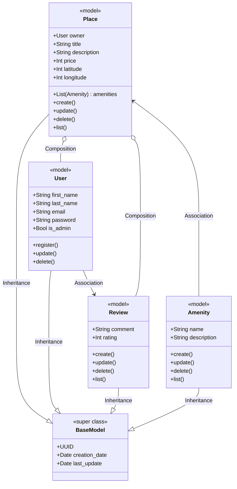
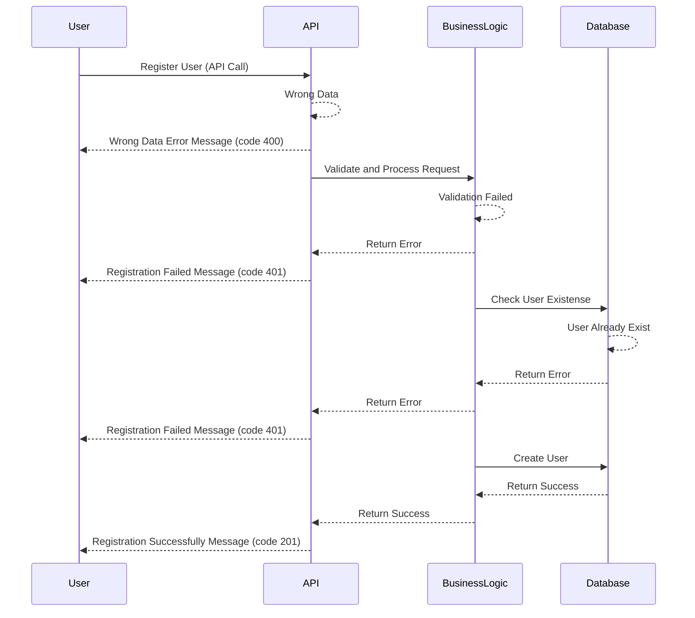
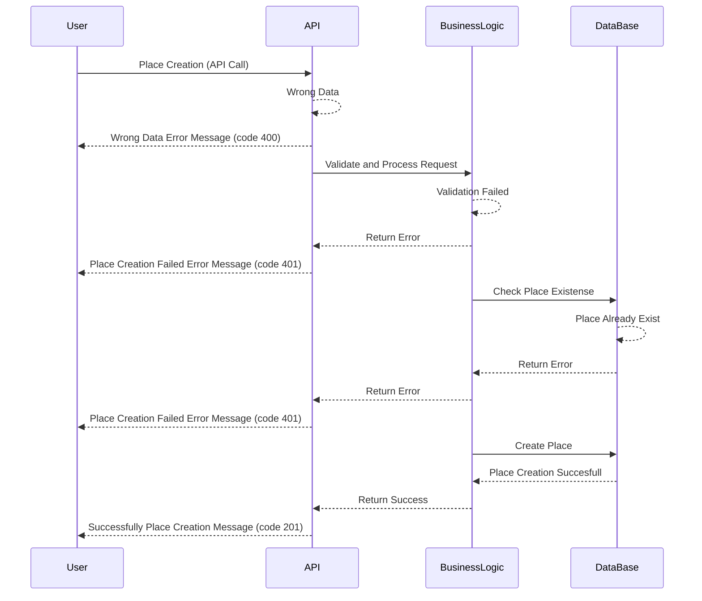
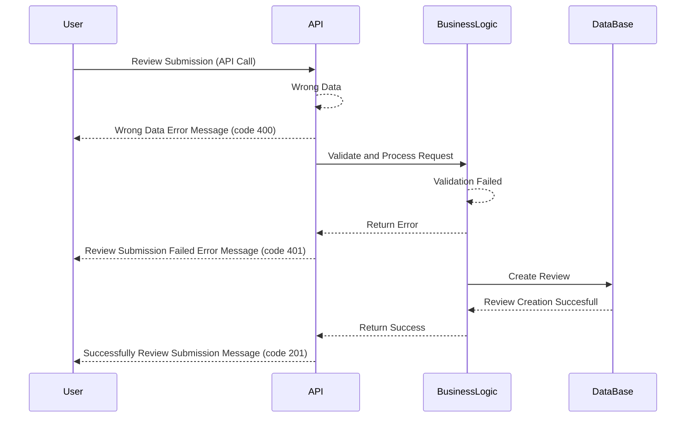
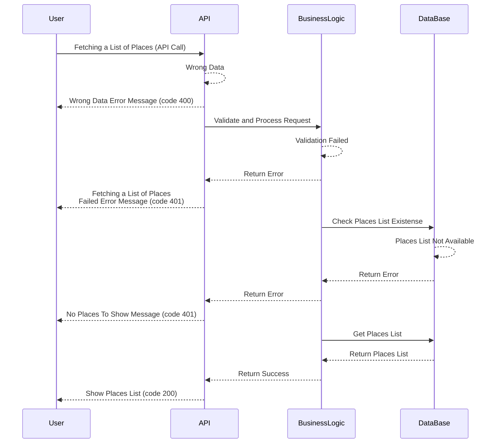

# HBnB Documentation


# Introduction to HBnB
This document was created to help understand and implement the HBnB project, a simplified version of AirBnB developed as part of a learning process. Its goal is to clearly explain how the system works, what components it consists of, and how to get it up and running step by step.

HBnB allows the management of data such as users, places to stay, reviews, and more, all through a well-organized structure designed to scale. Throughout this document, you will find information about the tools used, how they connect with each other, and what is needed for everything to work correctly.

The idea is that this guide serves as support both for those working directly on the project and for those who need to understand or maintain it in the future.

## What is a Three-Tier Architecture?

Three-tier architecture is a software design pattern that organizes an application into three independent layers, each with clearly defined responsibilities. This approach separates the presentation logic, business logic, and data access logic, promoting better code organization, greater maintainability, and system scalability.

## The three layers of the architecture are:

### Presentation Layer
This is the top layer that users interact with directly. Its function is to display information and collect input from the user. It acts as the user interface of the application, rendering web pages and handling user requests.

### Business Logic Layer
This middle layer acts as the "brain" of the application, processing requests from the presentation layer and applying core business rules. It manages key application logic such as user authentication, data validation, and business workflows. It processes information from the presentation layer and interacts with the data layer.

### Persistence Layer
This is the back-end layer that stores and manages the application's data. It is only accessed by the application layer, never directly by the presentation layer. It handles data storage, retrieval, and manipulation, ensuring persistence across user sessions.


## Use of the Facade Pattern in a Three-Tier Architecture
### What is the Facade Pattern?

The Facade pattern provides a single, simplified interface to a complex system, acting as a front-facing layer that hides the intricacies of underlying components and their interactions. It improves code readability and usability by reducing dependencies and offering a clearer entry point for clients to interact with a subsystem without needing to understand its internal complexity.

## Where is the Facade Pattern applied in HBnB?

In the three-tier architecture, the Facade pattern is applied in the Core layer, serving as a unified gateway between the API and the business logic.

Without Facade: The API would need to directly access all the Core classes (User, Place, Review, Amenity) and understand how to interact with each of them, leading to tight coupling.

With Facade: The API interacts only with a central class or module (a "facade"), which internally coordinates all necessary operations. This simplifies communication and improves modularity.

## Database Operations in a Three-Tier Architecture

Database operations refer to the fundamental actions of creating, reading, updating, and deleting (CRUD) data within the application's back-end database.

The purpose of the Data Access Layer is to isolate data access from the rest of the application. This way, the upper layers (like the business logic or API) don’t need to know how the database operations are implemented or worry about SQL statements, database connections, or transaction handling.

By encapsulating these concerns in a dedicated layer, the system becomes more modular, testable, and easier to maintain.


# Detailed Class Diagram for Business Logic Layer


# Detailed Class Diagram for Business Logic Layer
## Introduction

This document describes the class model designed for the application. The goal is to model the system’s main entities, their attributes, operations, and the relationships between them, ensuring a clear structure for future implementation.

The system is based on an HBnB-style model, where users can register places, manage amenities, and write reviews.

## General Description

The class diagram represents the main entities of the application and their relationships. It consists of five key classes: BaseModel, User, Place, Amenity, and Review.

The BaseModel class acts as a superclass that provides common attributes, such as a unique identifier and timestamps, ensuring consistency across all entities. The User class represents the individuals registered in the system, while the Place class models the properties that users can list or rent. The Amenity class describes additional services or features that a place can offer, such as Wi-Fi or parking. Finally, the Review class allows users to provide feedback through comments and ratings on listed places.

All classes inherit from BaseModel, ensuring that they share a unified structure for identification and time management. The relationships between classes are also clearly defined: a Place is linked to a single User as its owner, may contain multiple Amenities, and can receive multiple Reviews. Additionally, users are directly associated with the reviews they create.

This structure establishes a solid foundation for representing the application’s domain and provides a clear blueprint for implementation in code.

## Class Documentation
## Class BaseModel

**Type:** Superclass

**Purpose:** Provides basic attributes common to all system entities.

### Attributes:

**uuid:** Universal unique identifier.

**creation_date:** Creation date.

**last_update:** Last modification date.

## Class User

**Type:** Model

**Purpose:** Represents the users registered in the system.

### Attributes:

**first_name:** User’s first name.

**last_name:** User’s last name.

**email:** User’s email address.

**password:** Encrypted password.

**is_admin:** Indicates whether the user has admin privileges.

### Methods:

**register():** Creates a new user.

**update():** Updates user information.

**delete():** Deletes a user.

## Class Place

**Type:** Model

**Purpose:** Represents a place available for hosting or rental.

### Attributes:

**owner:** The user who owns the place.

**title:** Place title or name.

**description:** Place description.

**price:** Price per stay.

**latitude:** Latitude coordinate.

**longitude:** Longitude coordinate.

**amenities:** List of amenities associated with the place.

### Methods:

**create():** Creates a new place.

**update():** Updates place information.

**delete():** Deletes a place.

**list():** Returns the available places.

## Class Amenity

**Type:** Model

**Purpose:** Defines additional services that a place may offer (e.g., Wi-Fi, pool, parking).

### Attributes:

**name:** Amenity name.

**description:** Short description.

### Methods:

**create():** Creates an amenity.

**update():** Updates amenity information.

**delete():** Deletes an amenity.

**list():** Lists all available amenities.

## Class Review

**Type:** Model

**Purpose:** Stores reviews written by users about places.

### Attributes:

**comment:** Review text.

**rating:** Numeric rating.

### Methods:

**create():** Creates a review.

**update():** Updates a review.

**delete():** Deletes a review.

**list():** Lists existing reviews


## Relationships Between Classes

**Inheritance:**

All classes (User, Place, Amenity, Review) inherit from BaseModel, sharing identity and time-related attributes.

**Composition:**

Place composes User: each place belongs to one owner.

Place composes Amenity: a place can include multiple amenities.

Place composes Review: a place can contain multiple reviews.

**Association:**

User associated Review: A user can create multiple reviews.


# Sequence Diagrams for API Calls

# User Registration sequence



## General Description

The Register User use case allows a new user to create an account in the system.
The process involves four main components: User, API, Business Logic Layer, and Database.
The flow considers both successful scenarios and errors (incorrect data, existing user, failed validations).

## Components

**User:** Interacts with the system interface to submit registration data.

**API:** Receives requests from the user and forwards the information to the business logic layer.

**BusinessLogic:** Validates the information, checks for existing users, and applies business rules.

**Database:** Stores the new user information persistently and returns confirmations or errors.

## Process Flow
### Main Flow (Successful Registration)

1. The User submits the registration data to the API.

2. The API forwards the request to BusinessLogic for validation.

3. BusinessLogic validates the data and checks that the user does not already exist.

4. If everything is correct, a request is sent to the Database to create the new user.

5. The Database confirms the creation.

6. BusinessLogic receives the confirmation and returns success to the API.

7. The API sends the User a registration success message (HTTP 201).

## Alternative Flows (Errors)

### Incorrect Data

If the data submitted by the user is invalid, BusinessLogic returns a validation error.

The API responds with HTTP 400 and message: Wrong Data Error Message.

### Failed Validation

If the data does not meet the business rules (e.g., weak password), BusinessLogic returns an error.

The API responds with HTTP 401 and message: Registration Failed Message.

### User Already Exists

If the user’s email is already registered, BusinessLogic detects the existing account and returns an error.

The API responds with HTTP 401 and message: Registration Failed Message.

# Place Creation sequence


## General Description

The Place Creation use case allows a user to create a new Place within the system.
The process covers the entire flow — from when the user submits the place data until the system validates and stores it in the database.
This flow includes both successful and error scenarios such as invalid data, validation failure, or an already existing place.

## Components

User: Interacts with the system interface to create a new place.

API: Receives the user’s request, performs initial checks, and forwards it to the business logic layer.

BusinessLogic: Applies business rules, verifies if the place already exists, and handles the creation process.

Database: Stores the new place information and returns confirmation or error messages.

## Process Flow
### Main Flow (Successful Registration)


1. The User sends a request to the API to create a new place.

2. The API receives the request and forwards it to the BusinessLogic layer.

3. BusinessLogic validates the received data.

4. It checks the Database to verify if the place already exists.

5. If the place does not exist, BusinessLogic requests the Database to create a new record.

6. The Database confirms that the place was successfully created.

7. BusinessLogic sends a success message back to the API.

8. The API responds to the User with a successful creation message (HTTP 201).

## Alternative Flows (Errors)
### Invalid Data

If the data sent by the user is invalid (missing fields, wrong format, etc.), the API returns:

HTTP Code: 400

Message: Wrong Data Error Message.

### Validation Failed

If the BusinessLogic detects that the data does not meet business rules (e.g., too short name, invalid location):

HTTP Code: 401

Message: Place Creation Failed Error Message.

### Place Already Exists

If the place already exists in the database, BusinessLogic returns an error:

HTTP Code: 401

Message: Place Creation Failed Error Message

## Review Submission sequence



## General Description
The Submit Review use case allows a user to send a review through the system. The process involves four main components: User, API, Business Logic Layer, and Database. The flow includes both successful and alternative error scenarios (e.g., wrong data, validation failures).

## Components
User: Interacts with the system interface to submit a review.


API: Receives the review submission request and forwards it to the business logic layer.


BusinessLogic: Validates the review data and applies business rules.


Database: Stores the review and returns confirmations or error messages.

## Process Flow
### Main Flow (Successful Review Submission)
1. The User submits a review via the API.

2. The API forwards the request to the BusinessLogic for validation and processing.

3. The BusinessLogic validates the review and ensures it meets the required rules.

4. If everything is correct, BusinessLogic sends a request to the Database to store the review.
 
5. The Database confirms the creation of the review.

6. BusinessLogic returns the success response to the API.

7. The API returns a successful review submission message to the User (HTTP 201).

## Alternative Flows (Errors)
### Incorrect Data
If the review data is incorrect or malformed:

The API detects the issue and returns a validation error.

The User receives: Wrong Data Error Message (HTTP 400).

### Failed Validation
If the review fails business logic validation (e.g., empty comment, invalid rating):

BusinessLogic returns an error to the API.

The API responds to the User with: Review Submission Failed Error Message (HTTP 401).

## Fetching a List of Places sequence



## General Description
The Fetch Places List use case allows a user to retrieve a list of places stored in the system. The process involves four main components: User, API, Business Logic Layer, and Database. The flow considers both successful scenarios and error cases (incorrect data, failed validations, list not available).

## Components
User: Interacts with the system interface to request a list of places.


API: Receives the request from the user and forwards it to the Business Logic Layer.


BusinessLogic: Validates the request, applies business rules, and checks data availability.


Database: Stores and returns the list of places or related errors.

## Process Flow
### Main Flow (Successful Fetching of Places List)
1. The User requests the list of places through the API.

2. The API forwards the request to BusinessLogic for validation and processing.

3. BusinessLogic validates the data and ensures the list exists in the Database.

4. BusinessLogic sends a request to the Database to get the list of places.

5. The Database returns the list of places to BusinessLogic.

6. BusinessLogic returns the list to the API.

7. The API sends the User the list of places with a success message (HTTP 200).

## Alternative Flows (Errors)
### Incorrect Data
If the request contains invalid or malformed data, the API directly detects it.

The API responds with HTTP 400 and message: Wrong Data Error Message.

### Failed Validation
If the request fails to meet business rules (e.g., missing parameters), BusinessLogic returns an error.

The API responds with HTTP 401 and message: Fetching a List of Places Failed Error Message.

### Places List Not Available
If the requested list of places does not exist or is empty, BusinessLogic detects it through the Database.

The API responds with HTTP 401 and message: No Places To Show Message.


## HTTP Response Codes Explanation

**200:** OK - Successful request (no new resource created)


**201:** Created - New resource successfully created


**400:** Bad Request - Invalid or missing input data


**401:** Unauthorized / Validation Failed - Business rule violation or existing record

## The Project Directory Structure

```text
hbnb/
├── app/
│   ├── __init__.py
│   ├── api/
│   │   ├── __init__.py
│   │   ├── v1/
│   │       ├── __init__.py
│   │       ├── users.py
│   │       ├── places.py
│   │       ├── reviews.py
│   │       ├── amenities.py
│   ├── models/
│   │   ├── __init__.py
|   |   ├── basemodel.py
│   │   ├── user.py
│   │   ├── place.py
│   │   ├── review.py
│   │   ├── amenity.py
│   ├── services/
│   │   ├── __init__.py
│   │   ├── facade.py
│   ├── persistence/
│       ├── __init__.py
│       ├── repository.py
├── run.py
├── config.py
├── requirements.txt
├── README.md
```

## app/

Main application folder — contains the source code for the Flask app, divided into logical layers.

### __init__.py

Initializes the Flask app using the App Factory Pattern.
Sets up configuration, routes, and extensions for the application.

## app/api/

Contains the API endpoints that expose the system’s functionality.

### __init__.py

Marks this directory as a Python package and prepares it to load API versions.

## app/api/v1/

Holds version 1 of the REST API, defining all routes for system resources.

### __init__.py

Registers the API namespaces (users, places, reviews, amenities).

### users.py

Endpoints for managing users (create, read, update, delete).

### places.py

Endpoints for managing places and their relationships with users and amenities.

### reviews.py

Endpoints for managing user reviews on places.

### amenities.py

Endpoints for managing amenities (Wi-Fi, pool, parking, etc.).

## app/models/

Defines the domain layer, where the main entities and their behavior are implemented.

### __init__.py

Makes the directory a Python module and may include shared initialization code.

### user.py

Defines the User class (name, email, permissions, etc.).

### place.py

Defines the Place class (location info, owner, amenities, reviews).

### review.py

Defines the Review class (feedback from users about places).

### amenity.py

Defines the Amenity class (features or services offered at a place)

## app/services/

Implements the business logic layer, acting as a bridge between the API, models, and persistence.

### __init__.py

Creates a singleton instance of the Facade, ensuring consistent access across the app.

### facade.py

Defines the Facade class, which provides a unified interface to interact with models and data repositories.

## app/persistence/

Handles the data access layer — currently using an in-memory repository, but structured to support future database integration.

### __init__.py

Marks the directory as a module and can initialize repository instances.

### repository.py

Implements the in-memory repository, managing CRUD operations for all entities and defining an extensible interface for future persistence layers.

## run.py

Main entry point of the application.
Launches the Flask app created by the App Factory and starts the API server.

## config.py

Contains configuration settings such as environment variables, database connections, and secret keys.
Supports different modes like development, testing, and production.

requirements.txt

Lists all Python dependencies required to run the project.
Install them with:
```text
pip install -r requirements.txt
```

## README.md

The main documentation file for the project.
Provides information about setup, usage, and overall system structure.
