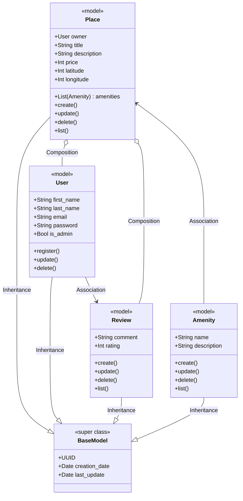
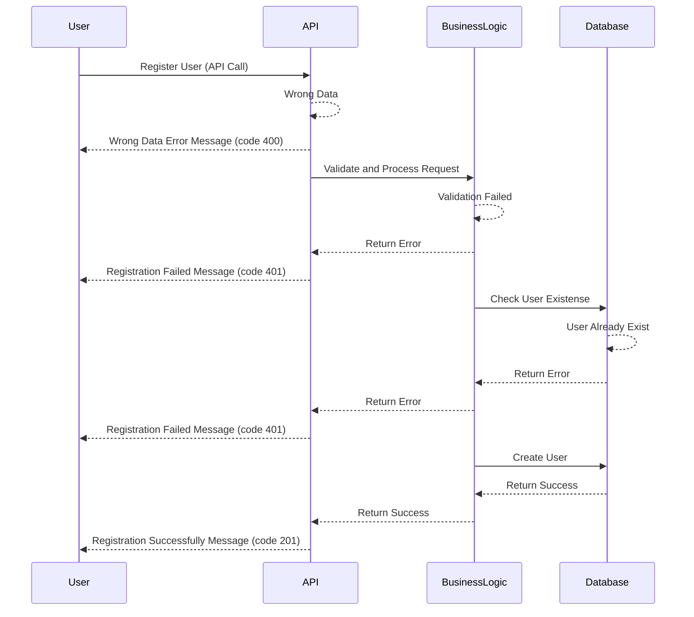
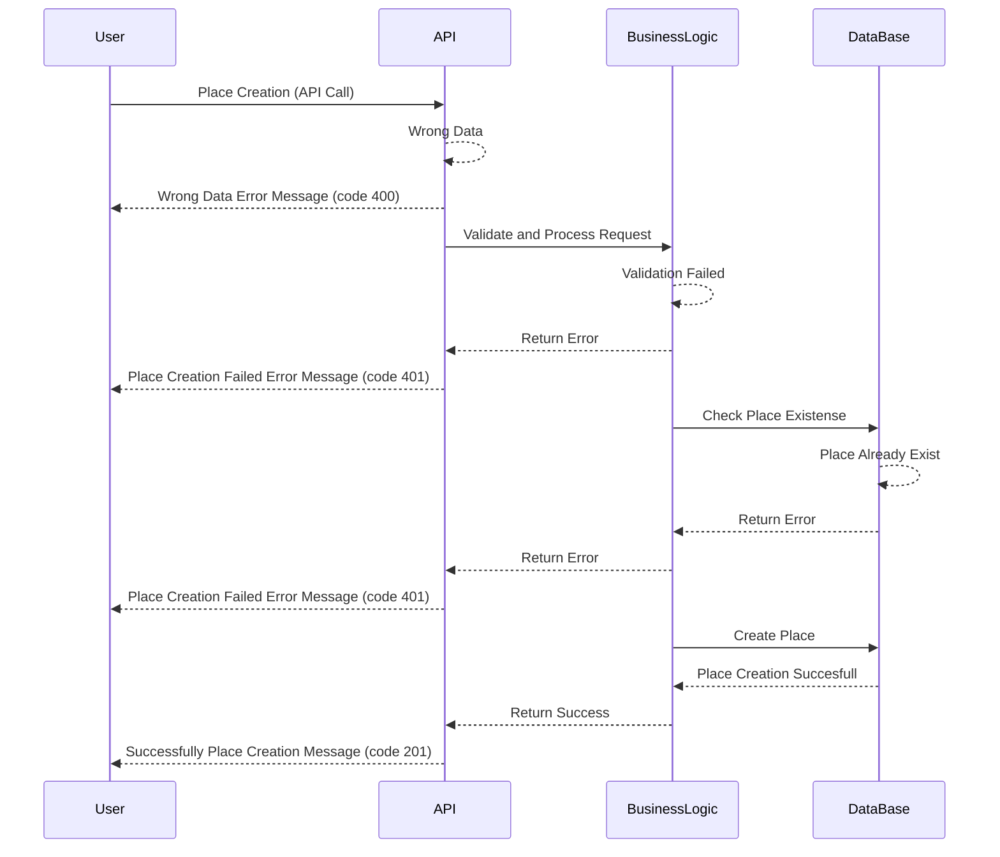
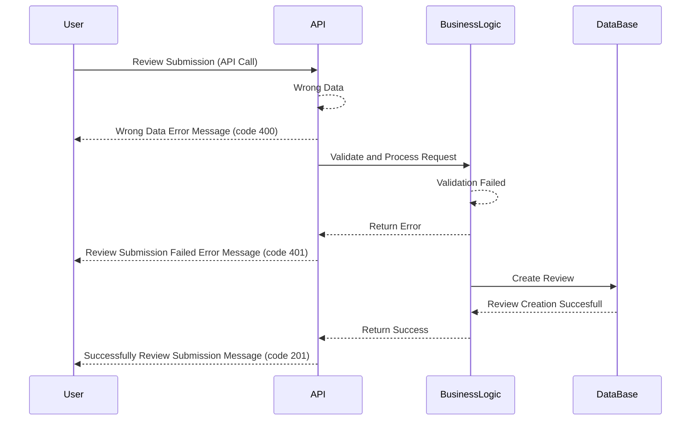
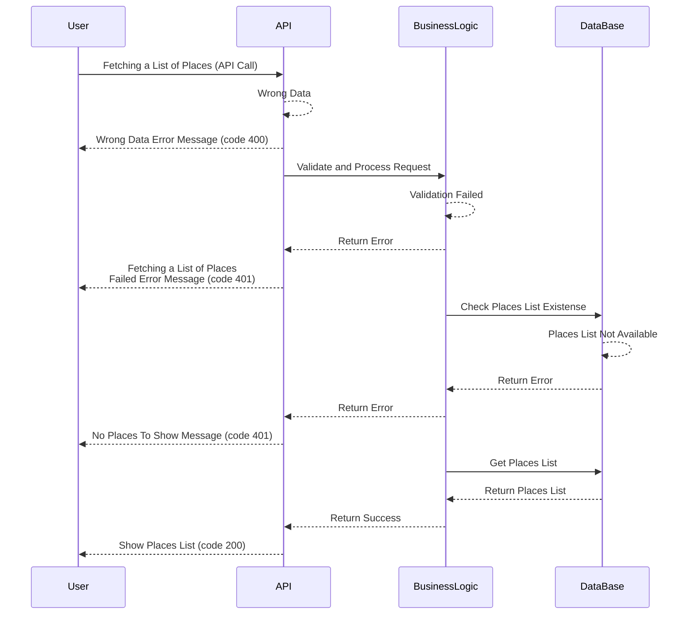

# HBnB Documentation

# Introduction to HBnB
This document was created to help understand and implement the HBnB project, a simplified version of AirBnB developed as part of a learning process. Its goal is to clearly explain how the system works, what components it consists of, and how to get it up and running step by step.

HBnB allows the management of data such as users, places to stay, reviews, and more, all through a well-organized structure designed to scale. Throughout this document, you will find information about the tools used, how they connect with each other, and what is needed for everything to work correctly.

The idea is that this guide serves as support both for those working directly on the project and for those who need to understand or maintain it in the future.

# Detailed Class Diagram for Business Logic Layer

# Detailed Class Diagram for Business Logic Layer
## Introduction

This document describes the class model designed for the application. The goal is to model the system’s main entities, their attributes, operations, and the relationships between them, ensuring a clear structure for future implementation.

The system is based on an HBnB-style model, where users can register places, manage amenities, and write reviews.

## General Description

The class diagram represents the main entities of the application and their relationships. It consists of five key classes: BaseModel, User, Place, Amenity, and Review.

The BaseModel class acts as a superclass that provides common attributes, such as a unique identifier and timestamps, ensuring consistency across all entities. The User class represents the individuals registered in the system, while the Place class models the properties that users can list or rent. The Amenity class describes additional services or features that a place can offer, such as Wi-Fi or parking. Finally, the Review class allows users to provide feedback through comments and ratings on listed places.

All classes inherit from BaseModel, ensuring that they share a unified structure for identification and time management. The relationships between classes are also clearly defined: a Place is linked to a single User as its owner, may contain multiple Amenities, and can receive multiple Reviews. Additionally, users are directly associated with the reviews they create.

This structure establishes a solid foundation for representing the application’s domain and provides a clear blueprint for implementation in code.

## Class Documentation
### Class BaseModel

**Type:** Superclass

**Purpose:** Provides basic attributes common to all system entities.

**Attributes:**

**uuid:** Universal unique identifier.

**creation_date:** Creation date.

**last_update:** Last modification date.

### Class User

**Type:** Model

**Purpose:** Represents the users registered in the system.

**Attributes:**

**first_name:** User’s first name.

**last_name:** User’s last name.

**email:** User’s email address.

**password:** Encrypted password.

**is_admin:** Indicates whether the user has admin privileges.

**Methods:**

**register():** Creates a new user.

**update():** Updates user information.

**delete():** Deletes a user.

### Class Place

**Type:** Model

**Purpose:** Represents a place available for hosting or rental.

**Attributes:**

**owner:** The user who owns the place.

**title:** Place title or name.

**description:** Place description.

**price:** Price per stay.

**latitude:** Latitude coordinate.

longitude: Longitude coordinate.

amenities: List of amenities associated with the place.

Methods:

create(): Creates a new place.

update(): Updates place information.

delete(): Deletes a place.

list(): Returns the available places.

### Class Amenity

Type: Model

Purpose: Defines additional services that a place may offer (e.g., Wi-Fi, pool, parking).

Attributes:

name: Amenity name.

description: Short description.

Methods:

create(): Creates an amenity.

update(): Updates amenity information.

delete(): Deletes an amenity.

list(): Lists all available amenities.

### Class Review

Type: Model

Purpose: Stores reviews written by users about places.

Attributes:

comment: Review text.

rating: Numeric rating.

Methods:

create(): Creates a review.

update(): Updates a review.

delete(): Deletes a review.

list(): Lists existing reviews

## Relationships Between Classes

Inheritance (--|>):
All classes (User, Place, Amenity, Review) inherit from BaseModel, sharing identity and time-related attributes.

Composition (o--):

Place composes User: each place belongs to one owner.

Place composes Amenity: a place can include multiple amenities.

Place composes Review: a place can contain multiple reviews.

Association (-->):

User → Review: A user can create multiple reviews.

# Sequence Diagrams for API Calls

# User Registration sequence

# Place Creation sequence

## Review Submission sequence

## Fetching a List of Places sequence

