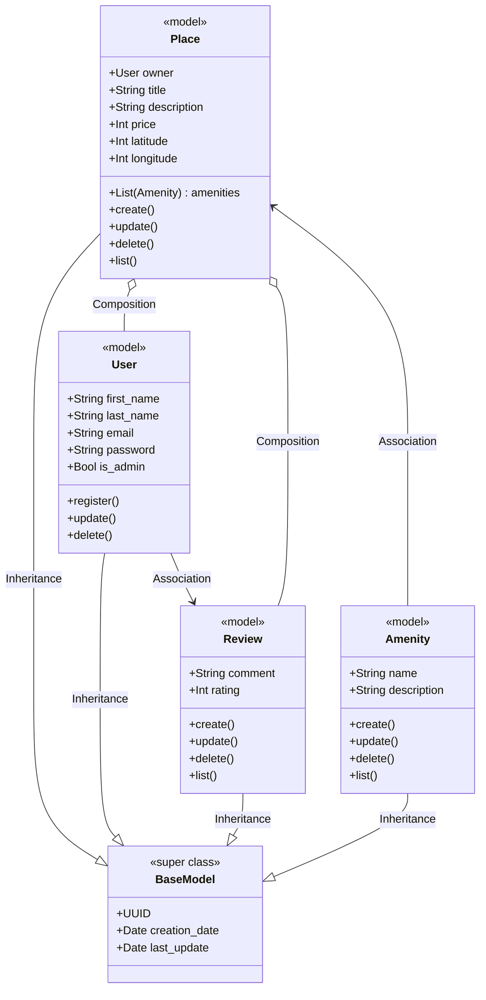
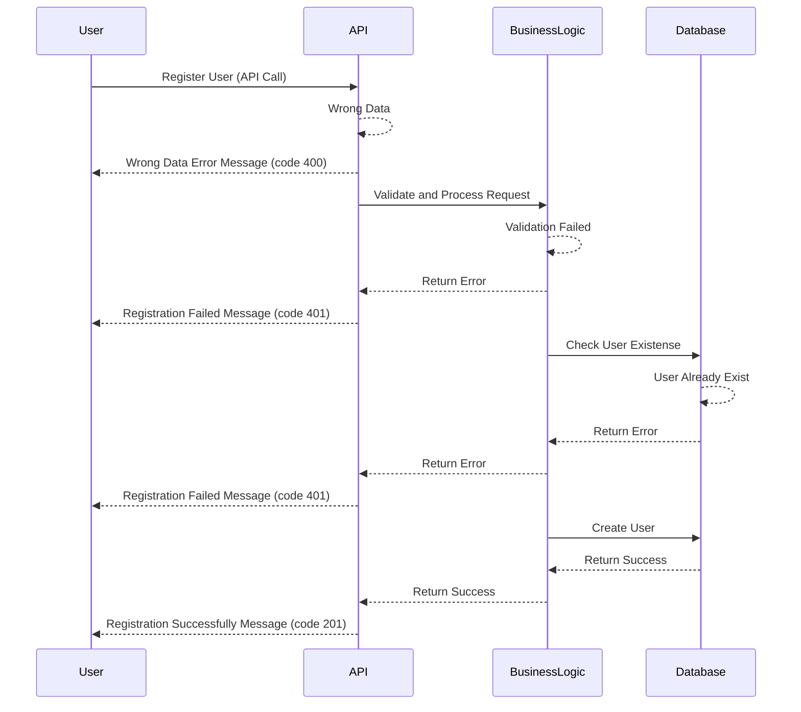
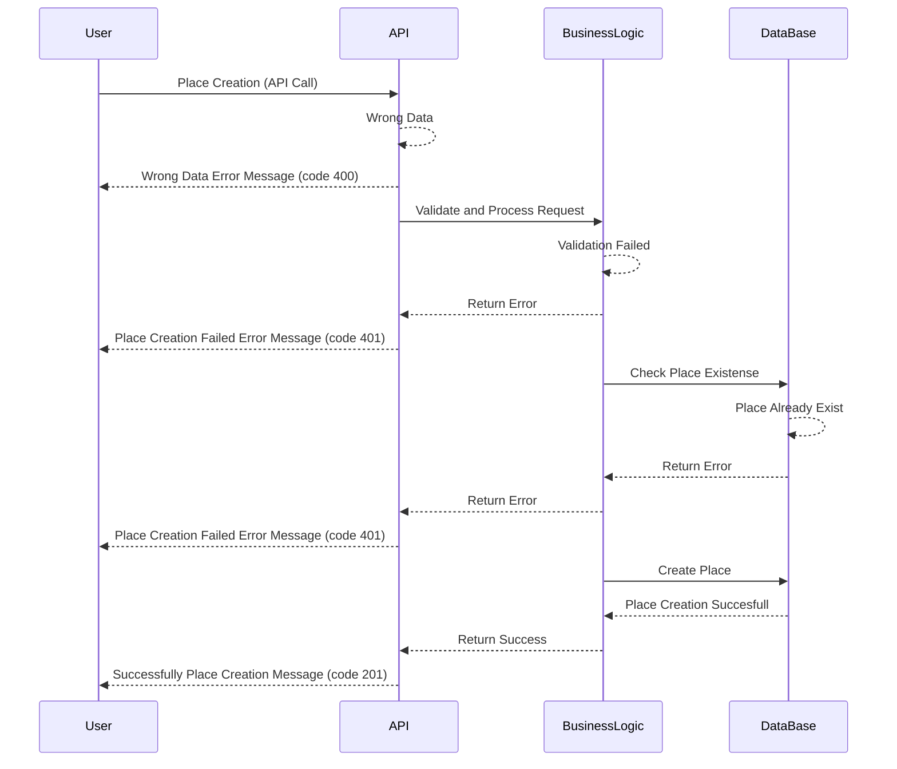

# HBnB Documentation

# Introduction to HBnB
This document was created to help understand and implement the HBnB project, a simplified version of AirBnB developed as part of a learning process. Its goal is to clearly explain how the system works, what components it consists of, and how to get it up and running step by step.

HBnB allows the management of data such as users, places to stay, reviews, and more, all through a well-organized structure designed to scale. Throughout this document, you will find information about the tools used, how they connect with each other, and what is needed for everything to work correctly.

The idea is that this guide serves as support both for those working directly on the project and for those who need to understand or maintain it in the future.

# Sequence Diagrams for API Calls

## User Registration sequence

## Place Creation sequence

